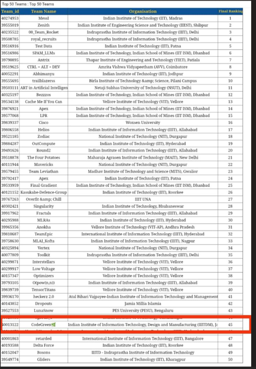
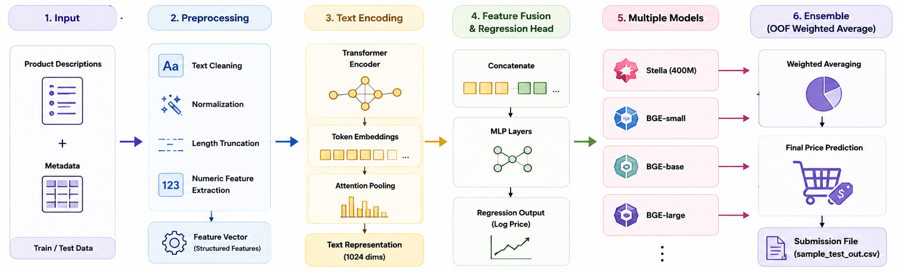

# Amazon ML Challenge 2025

Transformer-based product price prediction system built for the Amazon ML Challenge 2025.

The goal of the challenge was to predict product prices using real-world e-commerce product data, including product descriptions, metadata, and images.

Our final solution focused primarily on text-based modeling and achieved a **Top 50 Global Rank**.

---

# Overview

Pricing products accurately is a major challenge for e-commerce platforms and sellers.

This project predicts product prices directly from:
- product descriptions
- seller bullet points
- catalog metadata

using transformer-based representation learning and regression models.

The challenge dataset contained noisy, real-world product information similar to actual marketplace listings.

---

# Competition Goal

Given:
- product bullet-point descriptions
- metadata
- product images

predict the final product price.

Evaluation Metric:
- **SMAPE (Symmetric Mean Absolute Percentage Error)**
- Lower is better.

---

# Final Ranking

🏆 **Top 50 Global Rank**

The final ensemble solution achieved approximately:

```text
SMAPE: 42.30
```



---

# Pipeline Overview



---


# Initial Approach — Semantic Search

We initially started with a retrieval-based approach using semantic similarity.

### Step 1
We extracted CLS embeddings from:
- Qwen 2.5 (7B)

using product descriptions.

### Step 2
We used:
- FAISS semantic search

to retrieve similar products from the training set and averaged their prices.

This achieved approximately:

```text
SMAPE ≈ 60
```

Although simple, this provided a strong baseline.

---

# Tree-Based Regression Models

To improve performance, we trained:
- LightGBM
- XGBoost

on top of CLS embeddings extracted from transformer models.

This reduced SMAPE to approximately:

```text
SMAPE ≈ 55.9
```

However, performance quickly plateaued.

We identified the key issue:

CLS embeddings were unable to capture small but important semantic differences between products, especially in noisy e-commerce descriptions.

---

# Transition to Token-Level Embeddings

Instead of using only CLS embeddings, we moved to:
- full token embeddings

combined with:
- attention pooling
- lightweight regression heads

This allowed the model to preserve much finer semantic information.

---

# Stella Encoder Fine-Tuning

Due to hackathon constraints, fully fine-tuning large decoder LLMs like Qwen was impractical.

We therefore switched to:

```text
Marqo/dunzhang-stella_en_400M_v5
```

which is:
- encoder-only
- lightweight
- efficient for embedding tasks

---

# Fine-Tuning Strategy

To reduce:
- overfitting
- GPU memory usage
- training time

we:
- froze most encoder layers
- fine-tuned only the last 6 transformer layers

Additional structured numeric features were also extracted from text.

Examples:
- IPQ score
- numeric token counts
- text length
- premium brand indicators

---

# Custom Loss Function

The project used a custom hybrid loss combining:

- Huber Loss
- SMAPE Loss

This helped:
- stabilize optimization
- directly optimize the competition metric

Final loss:

```text
Loss = α(Huber) + β(SMAPE)
```

This significantly improved convergence and leaderboard performance.

---

# Image Features Exploration

We also explored incorporating image information.

Instead of full CNN fine-tuning (which was too time-intensive under hackathon constraints), we experimented with lightweight numeric image features such as:

- Laplacian variance
- edge density
- RGB ratios

These features showed promising correlation with product prices on small subsets.

However:
- computing features for ~150,000 images
- integrating them into the pipeline
- validating the improvements

was not feasible within the remaining competition time.

The final solution therefore focused entirely on maximizing text-model performance.

---

# Model Progression

| Approach | Description | SMAPE |
|---|---|---|
| Semantic Search (FAISS) | Average price of similar products using Qwen CLS embeddings | 60.0 |
| LightGBM / XGBoost | Tree models trained on CLS embeddings | 55.9 |
| BGE-small | Fine-tuned encoder model | 49.2 |
| BGE-base | Larger encoder model | 46.0 |
| BGE-large | Improved semantic representation | 43.4 |
| Stella (400M) | Token-level attention pooling + custom loss | 42.47 |
| Ensemble (BGE + Stella) | Weighted averaging using OOF SMAPE | 42.30 |

---

# Ensemble Strategy

The final submission used:
- multiple independently fine-tuned transformer models

including:
- BGE-small
- BGE-base
- BGE-large
- Stella

Predictions were combined using:
- simple averaging
- validation-based weighting
- out-of-fold SMAPE scores

This ensemble provided the final leaderboard boost.

---

# Key Features

- Transformer-based price prediction
- Token-level embedding aggregation
- Attention pooling
- Partial transformer fine-tuning
- Hybrid Huber + SMAPE loss
- Ensemble averaging
- Structured numeric feature extraction
- K-Fold validation support
- Efficient PyTorch training pipeline

---

# Repository Structure

```text
amazon-ml-challenge-2025/
│
├── train.csv
├── test.csv
│
├── stella.ipynb
├── ensemble_average.ipynb
│
├── assets/
│   ├── pipeline.png
│   ├── architecture.png
│   └── leaderboard.png
│
├── requirements.txt
├── .gitignore
└── README.md
```

---

# Training Pipeline

The training pipeline includes:

1. Text preprocessing
2. Feature extraction
3. Tokenization
4. Transformer encoding
5. Attention pooling
6. Regression head training
7. K-Fold validation
8. Ensemble averaging

---

# Technical Highlights

### Partial Fine-Tuning

Only the final transformer layers were unfrozen for training.

This:
- reduced training cost
- improved stability
- prevented catastrophic overfitting

---

### Attention Pooling

Instead of relying only on CLS embeddings, token-level embeddings were aggregated using learned attention weights.

This improved:
- semantic understanding
- fine-grained differentiation between products

---

### Structured Feature Fusion

Additional numeric features extracted from text were fused with transformer embeddings before regression.

Examples:
- text length
- numeric counts
- premium brand detection

---

# Installation

Clone the repository:

```bash
git clone https://github.com/sqqshh/Amazon-ML-Challenge-2025.git
cd amazon-ml-challenge-2025
```

Install dependencies:

```bash
pip install -r requirements.txt
```

---

# Training

Run:

```bash
stella.ipynb
```

This notebook contains:
- preprocessing
- model training
- validation
- inference pipeline

---

# Ensemble Inference

Run:

```bash
ensemble_average.ipynb
```

This notebook combines predictions from multiple fine-tuned models using averaging and OOF-weighted ensemble logic.

---

# Libraries Used

- PyTorch
- Hugging Face Transformers
- Stella 400M
- BGE Models
- LightGBM
- FAISS
- NumPy
- Pandas
- scikit-learn

---

# Lessons Learned

This challenge emphasized:

- rapid experimentation
- iterative modeling
- balancing speed vs performance
- practical ensemble design
- efficient fine-tuning strategies
- prioritizing approaches with highest ROI under time constraints

It also demonstrated how strong text representations alone can achieve highly competitive results even without multimodal training.

---

# Future Improvements

Potential future work includes:

- integrating image embeddings
- multimodal transformer architectures
- vision-language fusion
- contrastive representation learning
- better weighted ensemble optimization
- large-scale image feature extraction
- advanced retrieval-augmented regression

---

# Acknowledgements

- Amazon ML Challenge 2025
- Hugging Face Transformers
- Marqo Stella Embeddings
- BAAI BGE Models
- PyTorch
